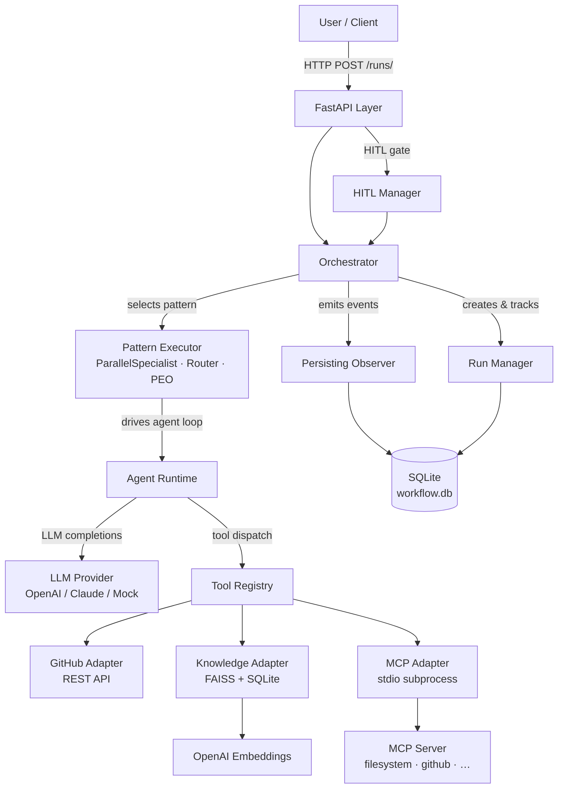

# Dynamic Multi-Agent Workflow Platform

A Python platform for building, running, and observing multi-agent AI workflows.
Define workflows as YAML, execute them through a REST API, and wire in real tools —
GitHub, FAISS-backed knowledge search, and MCP servers — without touching platform code.

**919 tests passing · Python 3.12+ · FastAPI · SQLite · FAISS · OpenAI**

---

## Why this exists

Most multi-agent demos hardcode agent logic and tool calls into application code.
This platform separates **what** agents do (YAML workflow definitions) from **how** they do it
(swappable LLM providers, adapter-based tools, pluggable patterns). The result is a clean
architectural boundary: new workflows are YAML files; new tool integrations are adapter classes;
the orchestration engine never changes.

---

## Architecture



---

## Project structure

```
api/
  main.py                    # FastAPI app + lifespan (startup indexing, shutdown)
  dependencies.py            # DI: orchestrator, DB session, knowledge service, planner
  routers/                   # runs · workflows · knowledge · hitl · planner
  schemas/                   # Pydantic request/response models

platform/
  agent/                     # AgentRuntime — LLM + tool loop per agent
  aggregator/                # ResultAggregator (concatenate strategy)
  config/                    # ConfigLoader, ConfigValidator — parse workflow YAML
  core/
    exceptions.py
    interfaces/              # ILLMProvider · IToolAdapter · IObserver · IPolicyEngine
    models/                  # WorkflowDefinition · AgentDefinition · ExecutionContext …
  hitl/                      # ApprovalManager — pause/resume for human review
  knowledge/                 # KnowledgeService · KnowledgeIndexer · FAISS vector store
  llm/                       # OpenAIProvider · ClaudeProvider · MockLLMProvider
  memory/                    # InMemoryStore
  observability/             # ConsoleObserver · PersistingObserver
  orchestrator/              # Orchestrator · RunManager
  patterns/                  # ParallelSpecialistExecutor · RouterExecutor · PEOExecutor
  persistence/               # SQLAlchemy models + repositories (runs, agents, tools, events, plans)
  planner/                   # V3.1 dynamic planner — goal analysis, plan builder, execution adapter
  policy/                    # PolicyEngine + ContentFilterRule
  registries/                # WorkflowRegistry · AgentRegistry · ToolRegistry
  state/                     # SharedState — per-run cross-agent key-value store
  tools/                     # GitHubAdapter · KnowledgeAdapter · MCPAdapter · HTTPAdapter · MockAdapter

workflows/                   # YAML workflow definitions (one folder per workflow)
  pr_review/                 # 4-agent production PR review (GitHub + RAG + MCP)
  devops_remediation/        # MCP filesystem analysis
  incident_commander/        # Parallel incident triage
  customer_support/          # Router-based support routing
  research_workflow/         # Planner-executor-observer research loop

resources/
  knowledge/
    coding-standards/        # PR review guidelines · coding standards · testing · security
    architecture/            # Platform architecture docs
    runbooks/                # Operational runbooks

tests/
  unit/                      # Fast isolated tests — no real API calls
  integration/               # End-to-end pattern tests using real YAML + MockLLMProvider
```

---

## Core capabilities

### Workflow patterns

| Pattern | `pattern` key | Description |
|---|---|---|
| Parallel Specialist | `parallel_specialist` | N agents run concurrently; outputs concatenated; optional reviewer synthesizes |
| Router | `router` | Classifier agent selects a route label; matched specialist handles the request |
| Planner-Executor-Observer | `planner_executor_observer` | Iterative loop: planner → executor → observer signals DONE or RETRY |

### Tool adapters

| Adapter | Purpose |
|---|---|
| `github` | GitHub REST API — fetch PRs, files, diffs |
| `knowledge` | FAISS semantic search over indexed Markdown/text collections |
| `mcp` | Any MCP server via stdio subprocess (filesystem, GitHub, custom) |
| `http` | Generic HTTP GET/POST with configurable headers |
| `mock` | Static response for local development and testing |

### Persistence

Every workflow run is persisted to SQLite: run status, per-agent outputs, every tool call (input + output + error flag), and all events. Inspect any past run without re-executing it.

---

## Included workflows

| Workflow ID | Pattern | Description |
|---|---|---|
| `pr_review` | parallel_specialist | 4-agent PR review: data fetch → code review + risk assessment → synthesis |
| `devops_remediation` | parallel_specialist | Read files via MCP filesystem server, produce structured analysis |
| `incident_commander` | parallel_specialist | Parallel triage: metrics + logs + deployment → reviewer synthesizes root cause |
| `customer_support` | router | Classify billing vs. technical query, route to specialist |
| `research_workflow` | planner_executor_observer | Iterative research loop with observer-controlled termination |

---

## Quick start

### 1. Install

```powershell
python -m venv .venv
.venv\Scripts\Activate.ps1
pip install -e ".[dev]"
```

### 2. Configure environment

```powershell
Copy-Item .env.example .env
```

Edit `.env`:

```env
# Required for LLM calls and knowledge embeddings
OPENAI_API_KEY=sk-...
OPENAI_MODEL=gpt-4o-mini          # optional, defaults to gpt-4o-mini

# Required for pr_review workflow (private repos) — omit for public repos
GITHUB_TOKEN=github_pat_...

# SQLite database path — defaults to ./workflow.db
DATABASE_URL=sqlite:///./workflow.db
```

### 3. Configure knowledge (optional — required for pr_review RAG)

`knowledge_config.yaml` is already present. The server indexes collections automatically at startup.

### 4. Run tests

```powershell
python -m pytest tests/ -q
```

All 919 tests use `MockLLMProvider` — no API keys required.

### 5. Start the API

```powershell
uvicorn api.main:app --reload
```

The server starts at `http://localhost:8000`. Interactive docs: `http://localhost:8000/docs`

At startup the server:
1. Loads all workflow YAML definitions from `workflows/`
2. Initializes the SQLite database
3. Indexes or refreshes knowledge collections (if `knowledge_config.yaml` is present)
4. Wires up tool registry with all configured adapters

---

## API reference

### Workflow execution

| Method | Path | Description |
|---|---|---|
| `POST` | `/runs/` | Trigger a workflow run |
| `GET` | `/runs/` | List all historical runs |
| `GET` | `/runs/{run_id}` | Get run status and output |
| `GET` | `/runs/{run_id}/details` | Full run details: agents, tool calls, events |
| `GET` | `/runs/{run_id}/events` | Raw event stream for a run |
| `POST` | `/runs/{run_id}/approve` | Approve a paused HITL run |
| `POST` | `/runs/{run_id}/reject` | Reject a paused HITL run |
| `GET` | `/workflows/` | List all loaded workflow definitions |

### Dynamic workflow planner (V3.1)

| Method | Path | Description |
|---|---|---|
| `POST` | `/planner/generate` | Analyze a natural-language goal and return a generated plan |
| `GET` | `/planner/{plan_id}` | Retrieve a previously generated plan by ID |
| `POST` | `/planner/{plan_id}/approve` | Approve a plan and execute it through the V2 runtime |
| `POST` | `/planner/{plan_id}/reject` | Reject a plan so it will not be executed |

### Knowledge

| Method | Path | Description |
|---|---|---|
| `POST` | `/knowledge/search` | Search knowledge collections |
| `GET` | `/knowledge/collections` | List indexed collections with stats |
| `GET` | `/knowledge/collections/{name}` | Collection detail (documents, chunk count) |

---

## Demo commands

> All examples use PowerShell. For bash/curl equivalents see below each block.

### PR Review (4-agent, GitHub + RAG + MCP)

```powershell
$body = @{
    workflow_id = "pr_review"
    input = @{ owner = "octocat"; repo = "Hello-World"; pull_number = 1 }
} | ConvertTo-Json -Depth 3

Invoke-RestMethod -Method POST `
    -Uri "http://localhost:8000/runs/" `
    -ContentType "application/json" `
    -Body $body
```

```bash
curl -s -X POST http://localhost:8000/runs/ \
  -H "Content-Type: application/json" \
  -d '{"workflow_id":"pr_review","input":{"owner":"octocat","repo":"Hello-World","pull_number":1}}' \
  | python -m json.tool
```

**What happens:**

```
POST /runs/  {workflow_id: pr_review, input: {owner, repo, pull_number}}
  → Orchestrator serialises input dict → JSON; stores original in SharedState
  → ParallelSpecialistExecutor selects the 4-agent workflow

  Parallel (3 agents run concurrently):
    pr_data_agent
      → github_get_pr    GET /repos/{owner}/{repo}/pulls/{n}
      → github_get_files GET /repos/{owner}/{repo}/pulls/{n}/files
      → github_get_diff  GET /repos/{owner}/{repo}/pulls/{n}  (Accept: application/vnd.github.diff)
      → returns structured PR data summary

    review_specialist
      → github_get_diff  (retrieves unified diff independently)
      → knowledge_search (queries coding-standards + architecture collections)
      → returns: Code Quality · Architecture · Maintainability · Standards Compliance

    risk_specialist
      → github_get_diff  (retrieves unified diff independently)
      → knowledge_search (queries security + testing guidelines)
      → returns: Security · Testing · Reliability · Performance — each rated Low/Medium/High

  Sequential (after all parallel complete):
    synthesis_agent
      → [optional] mcp_get_pr_comments (reads prior review threads via GitHub MCP)
      → returns: structured report with Verdict (APPROVED / REQUEST CHANGES / COMMENT)

  → PersistingObserver writes run, agent results, tool calls, events to SQLite
```

**Expected output shape:**

```json
{
  "run_id": "3f7a...",
  "workflow_id": "pr_review",
  "status": "completed",
  "output": "## Pull Request Summary\n...\n## Verdict\nAPPROVED — ..."
}
```

---

### DevOps Remediation (MCP filesystem)

Reads a file from the local filesystem via an MCP stdio server and produces a structured analysis.
Requires Node.js (`npx`) for the MCP server.

```powershell
Invoke-RestMethod -Method POST `
    -Uri "http://localhost:8000/runs/" `
    -ContentType "application/json" `
    -Body '{"workflow_id":"devops_remediation","input":"Analyse pyproject.toml"}'
```

```bash
curl -s -X POST http://localhost:8000/runs/ \
  -H "Content-Type: application/json" \
  -d '{"workflow_id":"devops_remediation","input":"Analyse pyproject.toml"}' \
  | python -m json.tool
```

**What happens:**

```
file_analyst_agent
  → calls filesystem_read_file  (MCP tool: read_file)
     MCPAdapter → npx @modelcontextprotocol/server-filesystem .
       → reads file from filesystem
       → returns file contents
  → returns structured analysis
```

---

### Incident Commander (parallel triage)

```powershell
Invoke-RestMethod -Method POST `
    -Uri "http://localhost:8000/runs/" `
    -ContentType "application/json" `
    -Body '{"workflow_id":"incident_commander","input":"Production alert: payment-service p99 latency spiked to 4s"}'
```

Three specialists (metrics, logs, deployment) run in parallel; a reviewer synthesises the root cause.

---

### Customer Support Router

```powershell
Invoke-RestMethod -Method POST `
    -Uri "http://localhost:8000/runs/" `
    -ContentType "application/json" `
    -Body '{"workflow_id":"customer_support","input":"I was charged twice for my subscription"}'
```

A classifier routes to billing or technical specialist based on the query.

---

### Research Workflow (iterative)

```powershell
Invoke-RestMethod -Method POST `
    -Uri "http://localhost:8000/runs/" `
    -ContentType "application/json" `
    -Body '{"workflow_id":"research_workflow","input":"Summarise recent advances in sparse attention mechanisms"}'
```

Planner → Executor → Observer loop runs until the observer signals DONE.

---

### Inspect run history

List all runs:

```powershell
Invoke-RestMethod "http://localhost:8000/runs/"
```

```bash
curl -s http://localhost:8000/runs/ | python -m json.tool
```

Get full details for a specific run (agents, tool calls, events):

```powershell
Invoke-RestMethod "http://localhost:8000/runs/{run_id}/details"
```

```bash
curl -s http://localhost:8000/runs/{run_id}/details | python -m json.tool
```

The `/details` endpoint returns:
- `agent_results` — per-agent output and timing
- `tool_calls` — every tool invoked: name, input, output, error flag
- `events` — full ordered event stream for the run

---

### Knowledge search

```powershell
$body = '{"query":"input validation security","collections":["coding-standards"],"top_k":3}'
Invoke-RestMethod -Method POST `
    -Uri "http://localhost:8000/knowledge/search" `
    -ContentType "application/json" `
    -Body $body
```

```bash
curl -s -X POST http://localhost:8000/knowledge/search \
  -H "Content-Type: application/json" \
  -d '{"query":"input validation security","collections":["coding-standards"],"top_k":3}' \
  | python -m json.tool
```

List indexed collections:

```bash
curl http://localhost:8000/knowledge/collections
curl http://localhost:8000/knowledge/collections/coding-standards
```

---

## GitHub integration

The `github` adapter type calls the GitHub REST API via `httpx`. Three operations are supported:

| Tool name | Operation | GitHub endpoint |
|---|---|---|
| `github_get_pr` | `get_pull_request` | `GET /repos/{owner}/{repo}/pulls/{n}` |
| `github_get_files` | `get_changed_files` | `GET /repos/{owner}/{repo}/pulls/{n}/files` |
| `github_get_diff` | `get_diff` | `GET /repos/{owner}/{repo}/pulls/{n}` + diff media type |

Authentication is read from the `GITHUB_TOKEN` environment variable. Token is optional for public repositories (60 req/hr unauthenticated; 5,000 req/hr with token).

**Create a fine-grained token:** GitHub → Settings → Developer settings → Personal access tokens → Fine-grained tokens. Grant read-only access to **Repository contents** and **Pull requests**.

---

## Knowledge / RAG layer

```
resources/knowledge/
  coding-standards/   ← coding standards, testing, security, PR review guidelines
  architecture/       ← platform architecture reference
  runbooks/           ← operational runbooks
```

**How it works:**

1. At startup, `KnowledgeIndexer` hashes every source file in each collection directory.
2. Only collections whose files have changed (or are new) are re-indexed. Others are skipped.
3. Documents are chunked, embedded with OpenAI `text-embedding-3-small`, and stored in a FAISS index backed by SQLite metadata.
4. At runtime, `knowledge_search` embeds the query, runs a cosine-similarity search over FAISS, and returns the top-k chunks with source file and score.

**Configuration** (`knowledge_config.yaml`):

```yaml
knowledge:
  embedding:
    model: text-embedding-3-small
  vector_store:
    path: data/knowledge
  chunking:
    size: 1000
    overlap: 200
  retrieval:
    top_k: 5
  collections:
    - name: coding-standards
      path: resources/knowledge/coding-standards
    - name: architecture
      path: resources/knowledge/architecture
    - name: runbooks
      path: resources/knowledge/runbooks
```

If `knowledge_config.yaml` is missing, the server starts and logs a warning. Knowledge endpoints return HTTP 503.

**Adding new documents:** drop any `.md` or `.txt` file into the relevant collection directory and restart the server. The indexer will pick up the change automatically.

**Rebuild index manually:**

```bash
python -m scripts.index_knowledge
```

---

## MCP integration

The `mcp` adapter type connects to any [Model Context Protocol](https://modelcontextprotocol.io) server via stdio subprocess.

**How `MCPConnectionManager` works:**

1. On first tool call, the manager starts the MCP server subprocess via `npx` (or any configured command).
2. A `ClientSession` is created and initialized. `list_tools()` is called to discover available tools.
3. The session is **reused** for all subsequent calls — no reconnect overhead per tool call.
4. If the transport dies (broken pipe, process crash), the manager reconnects automatically on the next call.
5. At server shutdown, `adapter.close()` is called, which cleanly exits the session and kills the subprocess.

**Example configuration** (`tools.yaml`):

```yaml
- name: filesystem_read_file
  adapter_type: mcp
  adapter_config:
    server_command: npx
    server_args: ["-y", "@modelcontextprotocol/server-filesystem", "."]
    tool_name: read_file
```

**Available MCP servers used in this platform:**

| Workflow | MCP server | Tool |
|---|---|---|
| `devops_remediation` | `@modelcontextprotocol/server-filesystem` | `read_file` |
| `pr_review` (synthesis) | `@modelcontextprotocol/server-github` | `list_pull_request_review_comments` |

**Requirements:** Node.js must be installed for `npx` to work.

---

## SQLite persistence

Every workflow run is automatically persisted to `workflow.db`. Four tables are written:

| Table | Contents |
|---|---|
| `workflow_runs` | run_id, workflow_id, status, input, output, error, timestamps |
| `agent_results` | per-agent output for each run |
| `tool_calls` | every tool invoked: name, input JSON, output text, is_error flag |
| `workflow_events` | ordered event stream: run_started, agent_started, tool_called, run_completed … |

The database file path is configured via `DATABASE_URL` in `.env` (default: `./workflow.db`).

**Query run history directly:**

```powershell
# List all completed runs
Invoke-RestMethod "http://localhost:8000/runs/"

# Full details: agent outputs + tool calls + events
Invoke-RestMethod "http://localhost:8000/runs/{run_id}/details"

# Raw event stream
Invoke-RestMethod "http://localhost:8000/runs/{run_id}/events"
```

---

## HITL (Human-in-the-Loop)

Workflows with `hitl_enabled: true` pause after the parallel specialist phase and wait for manual approval before the reviewer agent runs.

```bash
# Approve a paused run
curl -X POST http://localhost:8000/runs/{run_id}/approve \
  -H "Content-Type: application/json" \
  -d '{"comment": "Looks good, proceed"}'

# Reject a paused run
curl -X POST http://localhost:8000/runs/{run_id}/reject \
  -H "Content-Type: application/json" \
  -d '{"reason": "Specialist outputs need revision"}'
```

---

## Adding a new workflow

1. Create `workflows/my_workflow/workflow.yaml`, `agents.yaml`, and `tools.yaml`
2. Restart the server — `ConfigLoader` scans `workflows/` at startup and registers everything automatically
3. `POST /runs/` with `"workflow_id": "my_workflow"`

No platform code changes required. The entire workflow is declarative YAML.

**Minimal workflow.yaml:**

```yaml
workflow_id: my_workflow
name: My Workflow
pattern: parallel_specialist
agent_ids: [specialist_a, specialist_b]
pattern_config:
  strategy: concatenate
  reviewer_agent_id: reviewer_agent
hitl_enabled: false
```

---

## V2 capabilities

V2 adds real-world integrations and production readiness on top of the V1 execution engine.

### V1 (complete)
- Three execution patterns: parallel_specialist, router, planner_executor_observer
- YAML-driven workflow definitions
- FastAPI REST API with `POST /runs/`, `GET /runs/{id}`
- Policy engine with content filtering
- Human-in-the-loop (HITL) gate
- Mock and HTTP tool adapters
- 217 passing tests

### V2 additions (complete)

**V2.1 — GitHub Integration**
- `GitHubAdapter` implementing `IToolAdapter` — calls GitHub REST API for PR metadata, changed files, and unified diffs
- Fine-grained token authentication; unauthenticated fallback for public repos
- `pr_review` workflow: 4-agent design (PR data fetch → code review + risk assessment → synthesis)

**V2.2 — SQLite Persistence**
- `PersistingObserver` writes every run, agent result, tool call, and event to SQLite
- `/runs/{id}/details` and `/runs/{id}/events` endpoints for full audit trail
- Run history survives server restarts

**V2.3 — Knowledge / RAG Layer**
- FAISS vector store + OpenAI embeddings
- Automatic incremental indexing (SHA-256 per-file change detection)
- `KnowledgeAdapter` as a first-class `IToolAdapter`
- `/knowledge/search`, `/knowledge/collections` REST endpoints
- Knowledge collections: `coding-standards` (PR review · testing · security guidelines), `architecture`
- `review_specialist` and `risk_specialist` in `pr_review` ground findings in retrieved standards

**V2.4 — Production PR Review Workflow**
- 4-agent parallel_specialist workflow replacing the 2-agent prototype
- `pr_data_agent`: fetches all GitHub data (metadata, files, diff)
- `review_specialist`: code quality + architecture review, grounded in coding-standards + architecture knowledge
- `risk_specialist`: security + testing + reliability + performance, grounded in security guidelines
- `synthesis_agent`: combines all findings into a structured report; optionally reads prior PR review threads via MCP
- Structured output: Summary · Risk Level · Code Quality · Security & Risk · Standards Compliance · Recommendations · Verdict

**V2.5 — MCP Integration**
- `MCPConnectionManager`: persistent stdio session, lazy connect, session reuse, auto-reconnect on transport failure
- `MCPAdapter` wraps `MCPConnectionManager` as an `IToolAdapter`; compatible with any MCP server
- Tool discovery via `list_tools()` on first connect; fail-fast on unknown tool names
- Clean shutdown wiring via `IToolAdapter.close()`
- `devops_remediation` workflow demonstrating MCP filesystem server integration

**V2 total: 684 tests passing**

---

## V3.1 — Dynamic Workflow Generation (complete)

V3.1 adds a natural-language planning layer above the V2 execution engine. Instead of authoring a YAML workflow definition, you describe your goal in plain English. The planner analyzes it, selects agents and tools from the registry, validates the plan, and lets you preview and approve it before anything executes.

**The V2 runtime is not modified.** The planner generates a `WorkflowDefinition` and hands it to the same `Orchestrator` that runs all existing YAML workflows.

### How it works

```
POST /planner/generate  {"goal": "Review PR #42 in org/repo"}
  ↓
GoalAnalyzer (1 LLM call)
  → Classifies task type (code_review)
  → Identifies required capabilities
  → Assesses risk level + HITL requirement
  ↓
PlanBuilder (deterministic Python)
  → Selects agents from CapabilityRegistry
  → Selects tools from CapabilityRegistry
  → Selects execution pattern
  → Generates guardrails
  → Estimates complexity + duration
  ↓
PlanValidator (deterministic Python)
  → 13 validation checks
  → Produces ValidationResult (errors + warnings)
  ↓
Plan persisted to SQLite (status: pending_review)
  ↓
Response: GeneratedWorkflowPlan + ValidationResult

GET /planner/{plan_id}          ← review the plan
POST /planner/{plan_id}/approve ← execute via V2 orchestrator
POST /planner/{plan_id}/reject  ← discard without executing
```

### Planner API

#### POST /planner/generate

Analyzes a natural-language goal and returns a generated plan with validation.

**Request:**
```json
{ "goal": "Review pull request #42 in the org/myrepo repository" }
```

**Response (201):**
```json
{
  "plan_id": "a3f7b2c1-...",
  "goal": "Review pull request #42 in the org/myrepo repository",
  "status": "pending_review",
  "goal_analysis": {
    "task_type": "code_review",
    "required_capabilities": ["fetch_pr_data", "review_code_quality", "assess_security", "synthesize_findings"],
    "risk_level": "low",
    "confidence": 0.92,
    "reasoning": "Goal clearly describes a GitHub pull request code review.",
    "constraints": ["read_only"],
    "requires_hitl": false
  },
  "selected_pattern": "parallel_specialist",
  "selected_agents": ["pr_data_agent", "review_specialist", "risk_specialist", "synthesis_agent"],
  "selected_tools": ["github_get_pr", "github_get_files", "github_get_diff", "knowledge_search", "mcp_get_pr_comments"],
  "guardrails": [
    { "rule_type": "content_filter", "config": {}, "reason": "All outputs reviewed for policy compliance" }
  ],
  "hitl_required": false,
  "warnings": [],
  "explanation": "Selected parallel_specialist pattern with 4 agents...",
  "estimated_complexity": "medium",
  "estimated_duration_seconds": 75,
  "validation": {
    "is_valid": true,
    "errors": [],
    "warnings": []
  }
}
```

**Error (422):** returned when the LLM cannot parse a valid `GoalAnalysis` (e.g., prompt injection, network error, malformed response).

#### GET /planner/{plan_id}

Returns the full plan including current status.

**Response (200):** Same shape as `POST /planner/generate`. `status` will be one of: `pending_review`, `executed`, `rejected`, `failed`.

**Response (404):** Plan not found.

#### POST /planner/{plan_id}/approve

Approves the plan and immediately executes it through the V2 orchestrator. Returns the run result.

**Request:**
```json
{ "input_data": { "owner": "org", "repo": "myrepo", "pull_number": 42 } }
```

`input_data` can be a string or a dict. It is passed directly to `Orchestrator.run()` as the workflow input.

**Response (200):**
```json
{
  "plan_id": "a3f7b2c1-...",
  "run_id": "8b2e4f1a-...",
  "status": "completed",
  "output": "## Pull Request Review\n..."
}
```

**Response (404):** Plan not found.

**Response (409):** Plan is not in `pending_review` status (already executed or rejected).

#### POST /planner/{plan_id}/reject

Rejects the plan. No execution occurs. The plan is marked `rejected` in the database.

**Request:**
```json
{ "reason": "Too many agents selected for this simple PR" }
```

`reason` is optional (defaults to empty string). It is not persisted — the rejection itself is the signal.

**Response (200):**
```json
{
  "plan_id": "a3f7b2c1-...",
  "goal": "Review pull request #42...",
  "status": "rejected",
  "execution_run_id": null,
  "created_at": "2026-06-30T10:00:00",
  "updated_at": "2026-06-30T10:05:00"
}
```

**Response (404):** Plan not found.

**Response (409):** Plan is not in `pending_review` status.

---

### Demo: Dynamic PR review plan

> All examples use PowerShell. `curl` equivalents follow each block.

**Step 1 — Generate the plan**

```powershell
$body = @{ goal = "Review pull request #42 in the org/myrepo repository" } | ConvertTo-Json
$plan = Invoke-RestMethod -Method POST `
    -Uri "http://localhost:8000/planner/generate" `
    -ContentType "application/json" `
    -Body $body
$plan | ConvertTo-Json -Depth 5
$planId = $plan.plan_id
```

```bash
PLAN=$(curl -s -X POST http://localhost:8000/planner/generate \
  -H "Content-Type: application/json" \
  -d '{"goal":"Review pull request #42 in the org/myrepo repository"}')
echo $PLAN | python -m json.tool
PLAN_ID=$(echo $PLAN | python -c "import sys,json; print(json.load(sys.stdin)['plan_id'])")
```

**Step 2 — Preview the plan**

```powershell
Invoke-RestMethod "http://localhost:8000/planner/$planId" | ConvertTo-Json -Depth 5
```

```bash
curl -s "http://localhost:8000/planner/$PLAN_ID" | python -m json.tool
```

**Step 3 — Approve and execute**

```powershell
$approveBody = @{
    input_data = @{ owner = "org"; repo = "myrepo"; pull_number = 42 }
} | ConvertTo-Json -Depth 3

$result = Invoke-RestMethod -Method POST `
    -Uri "http://localhost:8000/planner/$planId/approve" `
    -ContentType "application/json" `
    -Body $approveBody
$result | ConvertTo-Json -Depth 3
```

```bash
curl -s -X POST "http://localhost:8000/planner/$PLAN_ID/approve" \
  -H "Content-Type: application/json" \
  -d '{"input_data":{"owner":"org","repo":"myrepo","pull_number":42}}' \
  | python -m json.tool
```

**Step 4 — Inspect the run**

```powershell
$runId = $result.run_id
Invoke-RestMethod "http://localhost:8000/runs/$runId/details" | ConvertTo-Json -Depth 5
```

```bash
RUN_ID=$(echo $result | python -c "import sys,json; print(json.load(sys.stdin)['run_id'])")
curl -s "http://localhost:8000/runs/$RUN_ID/details" | python -m json.tool
```

**Step 5 — Reject a plan instead**

```powershell
Invoke-RestMethod -Method POST `
    -Uri "http://localhost:8000/planner/$planId/reject" `
    -ContentType "application/json" `
    -Body '{"reason":"Too broad — narrowing scope first"}'
```

```bash
curl -s -X POST "http://localhost:8000/planner/$PLAN_ID/reject" \
  -H "Content-Type: application/json" \
  -d '{"reason":"Too broad — narrowing scope first"}' \
  | python -m json.tool
```

---

### Live verification checklist

Run these checks after `uvicorn api.main:app --reload` to verify the end-to-end V3.1 flow:

1. **Generate a plan** — `POST /planner/generate` with a PR review goal returns HTTP 201 and a non-empty `plan_id`.
2. **Check validation** — response `validation.is_valid` is `true` and `selected_agents` contains at least `pr_data_agent` and `synthesis_agent`.
3. **Preview the plan** — `GET /planner/{plan_id}` returns HTTP 200 with `status: pending_review`.
4. **Approve and execute** — `POST /planner/{plan_id}/approve` with `input_data` returns HTTP 200 with a `run_id`.
5. **Verify execution** — `GET /runs/{run_id}/details` shows `status: completed` (or `waiting_approval` if HITL was triggered) and populated `agent_results`.
6. **Check persistence** — `GET /planner/{plan_id}` now returns `status: executed` with a non-null `execution_run_id`.
7. **Reject a fresh plan** — generate a second plan, then `POST /planner/{plan_id}/reject`; verify HTTP 200 with `status: rejected`.
8. **Double-approve guard** — attempt to approve the rejected plan; verify HTTP 409 response.

---

## V3.1 additions (complete)

**V3.1 — Dynamic Workflow Generation**
- `CapabilityRegistry` — static descriptors for all registered agents, tools, and execution patterns
- `GoalAnalyzer` — single LLM call converts a natural-language goal into a structured `GoalAnalysis`
- `PlanBuilder` — deterministic Python: selects agents, tools, pattern, and guardrails; estimates complexity and duration
- `PlanValidator` — 13 validation checks; produces `ValidationResult` with typed error and warning codes
- `PlannerService` — single entry point: `GoalAnalyzer → PlanBuilder → PlanValidator`
- `ExecutionAdapter` — converts `GeneratedWorkflowPlan` → `WorkflowDefinition` → `Orchestrator.run()` (V2 runtime unchanged)
- `PlanRepository` — persists plans to SQLite (`generated_plans` table); tracks status lifecycle
- Planner API — `POST /planner/generate`, `GET /planner/{plan_id}`, `POST /planner/{plan_id}/approve`, `POST /planner/{plan_id}/reject`
- V3.1 scope: one supported goal type (`code_review`). Agents selected from existing registry only. No dynamic agent generation.

**Total: 919 tests passing**

---

## V3 roadmap

| Feature | Status | Description |
|---|---|---|
| Dynamic workflow generation (V3.1) | **Complete** | Compose workflows from natural language — agents selected from registry, no YAML authoring required |
| Dynamic agent generation (V3.2) | Planned | Synthesize new `AgentDefinition` objects from templates for goals with no existing agents |
| Multi-goal support | Planned | Support goal types beyond `code_review`: incident triage, research, data analysis |
| PostgreSQL backend | Planned | Replace SQLite with PostgreSQL for production multi-instance deployments |
| Background task execution | Planned | Non-blocking `POST /runs/` with SSE/WebSocket for live progress streaming |
| Multi-provider LLM | Planned | Anthropic Claude and Google Gemini alongside OpenAI, runtime-selectable per agent |
| Agent memory persistence | Planned | Long-term per-agent memory across runs using the `IMemoryStore` interface |
| Workflow versioning | Planned | Immutable workflow snapshots; rerun any past run against its exact original definition |
| Auth and multi-tenancy | Planned | API key authentication and tenant-scoped workflow isolation |
