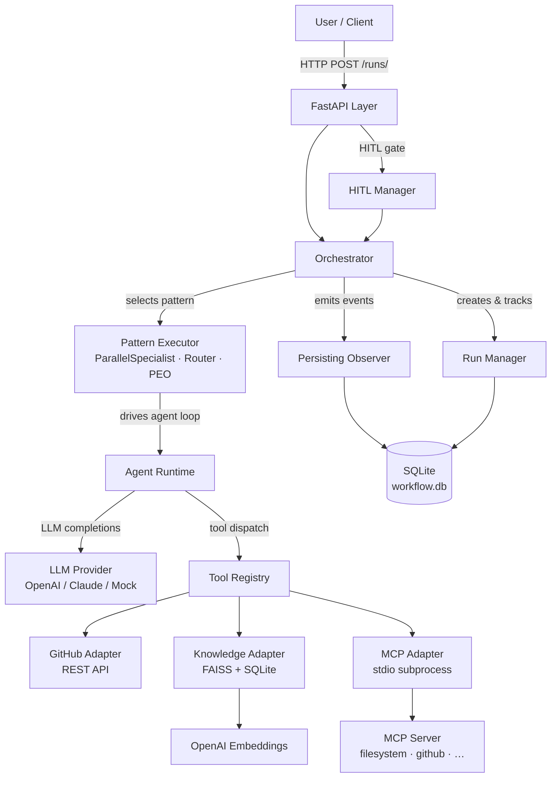

# Dynamic Multi-Agent Workflow Platform

A Python platform for building, running, and observing multi-agent AI workflows.
Define workflows as YAML, execute them through a REST API, and wire in real tools —
GitHub, FAISS-backed knowledge search, and MCP servers — without touching platform code.

**684 tests passing · Python 3.12+ · FastAPI · SQLite · FAISS · OpenAI**

---

## Why this exists

Most multi-agent demos hardcode agent logic and tool calls into application code.
This platform separates **what** agents do (YAML workflow definitions) from **how** they do it
(swappable LLM providers, adapter-based tools, pluggable patterns). The result is a clean
architectural boundary: new workflows are YAML files; new tool integrations are adapter classes;
the orchestration engine never changes.

---

## Architecture



---

## Project structure

```
api/
  main.py                    # FastAPI app + lifespan (startup indexing, shutdown)
  dependencies.py            # DI: orchestrator, DB session, knowledge service
  routers/                   # runs · workflows · knowledge · hitl
  schemas/                   # Pydantic request/response models

platform/
  agent/                     # AgentRuntime — LLM + tool loop per agent
  aggregator/                # ResultAggregator (concatenate strategy)
  config/                    # ConfigLoader, ConfigValidator — parse workflow YAML
  core/
    exceptions.py
    interfaces/              # ILLMProvider · IToolAdapter · IObserver · IPolicyEngine
    models/                  # WorkflowDefinition · AgentDefinition · ExecutionContext …
  hitl/                      # ApprovalManager — pause/resume for human review
  knowledge/                 # KnowledgeService · KnowledgeIndexer · FAISS vector store
  llm/                       # OpenAIProvider · ClaudeProvider · MockLLMProvider
  memory/                    # InMemoryStore
  observability/             # ConsoleObserver · PersistingObserver
  orchestrator/              # Orchestrator · RunManager
  patterns/                  # ParallelSpecialistExecutor · RouterExecutor · PEOExecutor
  persistence/               # SQLAlchemy models + repositories (runs, agents, tools, events)
  policy/                    # PolicyEngine + ContentFilterRule
  registries/                # WorkflowRegistry · AgentRegistry · ToolRegistry
  state/                     # SharedState — per-run cross-agent key-value store
  tools/                     # GitHubAdapter · KnowledgeAdapter · MCPAdapter · HTTPAdapter · MockAdapter

workflows/                   # YAML workflow definitions (one folder per workflow)
  pr_review/                 # 4-agent production PR review (GitHub + RAG + MCP)
  devops_remediation/        # MCP filesystem analysis
  incident_commander/        # Parallel incident triage
  customer_support/          # Router-based support routing
  research_workflow/         # Planner-executor-observer research loop

resources/
  knowledge/
    coding-standards/        # PR review guidelines · coding standards · testing · security
    architecture/            # Platform architecture docs
    runbooks/                # Operational runbooks

tests/
  unit/                      # Fast isolated tests — no real API calls
  integration/               # End-to-end pattern tests using real YAML + MockLLMProvider
```

---

## Core capabilities

### Workflow patterns

| Pattern | `pattern` key | Description |
|---|---|---|
| Parallel Specialist | `parallel_specialist` | N agents run concurrently; outputs concatenated; optional reviewer synthesizes |
| Router | `router` | Classifier agent selects a route label; matched specialist handles the request |
| Planner-Executor-Observer | `planner_executor_observer` | Iterative loop: planner → executor → observer signals DONE or RETRY |

### Tool adapters

| Adapter | Purpose |
|---|---|
| `github` | GitHub REST API — fetch PRs, files, diffs |
| `knowledge` | FAISS semantic search over indexed Markdown/text collections |
| `mcp` | Any MCP server via stdio subprocess (filesystem, GitHub, custom) |
| `http` | Generic HTTP GET/POST with configurable headers |
| `mock` | Static response for local development and testing |

### Persistence

Every workflow run is persisted to SQLite: run status, per-agent outputs, every tool call (input + output + error flag), and all events. Inspect any past run without re-executing it.

---

## Included workflows

| Workflow ID | Pattern | Description |
|---|---|---|
| `pr_review` | parallel_specialist | 4-agent PR review: data fetch → code review + risk assessment → synthesis |
| `devops_remediation` | parallel_specialist | Read files via MCP filesystem server, produce structured analysis |
| `incident_commander` | parallel_specialist | Parallel triage: metrics + logs + deployment → reviewer synthesizes root cause |
| `customer_support` | router | Classify billing vs. technical query, route to specialist |
| `research_workflow` | planner_executor_observer | Iterative research loop with observer-controlled termination |

---

## Quick start

### 1. Install

```powershell
python -m venv .venv
.venv\Scripts\Activate.ps1
pip install -e ".[dev]"
```

### 2. Configure environment

```powershell
Copy-Item .env.example .env
```

Edit `.env`:

```env
# Required for LLM calls and knowledge embeddings
OPENAI_API_KEY=sk-...
OPENAI_MODEL=gpt-4o-mini          # optional, defaults to gpt-4o-mini

# Required for pr_review workflow (private repos) — omit for public repos
GITHUB_TOKEN=github_pat_...

# SQLite database path — defaults to ./workflow.db
DATABASE_URL=sqlite:///./workflow.db
```

### 3. Configure knowledge (optional — required for pr_review RAG)

`knowledge_config.yaml` is already present. The server indexes collections automatically at startup.

### 4. Run tests

```powershell
python -m pytest tests/ -q
```

All 684 tests use `MockLLMProvider` — no API keys required.

### 5. Start the API

```powershell
uvicorn api.main:app --reload
```

The server starts at `http://localhost:8000`. Interactive docs: `http://localhost:8000/docs`

At startup the server:
1. Loads all workflow YAML definitions from `workflows/`
2. Initializes the SQLite database
3. Indexes or refreshes knowledge collections (if `knowledge_config.yaml` is present)
4. Wires up tool registry with all configured adapters

---

## API reference

| Method | Path | Description |
|---|---|---|
| `POST` | `/runs/` | Trigger a workflow run |
| `GET` | `/runs/` | List all historical runs |
| `GET` | `/runs/{run_id}` | Get run status and output |
| `GET` | `/runs/{run_id}/details` | Full run details: agents, tool calls, events |
| `GET` | `/runs/{run_id}/events` | Raw event stream for a run |
| `POST` | `/runs/{run_id}/approve` | Approve a paused HITL run |
| `POST` | `/runs/{run_id}/reject` | Reject a paused HITL run |
| `GET` | `/workflows/` | List all loaded workflow definitions |
| `POST` | `/knowledge/search` | Search knowledge collections |
| `GET` | `/knowledge/collections` | List indexed collections with stats |
| `GET` | `/knowledge/collections/{name}` | Collection detail (documents, chunk count) |

---

## Demo commands

> All examples use PowerShell. For bash/curl equivalents see below each block.

### PR Review (4-agent, GitHub + RAG + MCP)

```powershell
$body = @{
    workflow_id = "pr_review"
    input = @{ owner = "octocat"; repo = "Hello-World"; pull_number = 1 }
} | ConvertTo-Json -Depth 3

Invoke-RestMethod -Method POST `
    -Uri "http://localhost:8000/runs/" `
    -ContentType "application/json" `
    -Body $body
```

```bash
curl -s -X POST http://localhost:8000/runs/ \
  -H "Content-Type: application/json" \
  -d '{"workflow_id":"pr_review","input":{"owner":"octocat","repo":"Hello-World","pull_number":1}}' \
  | python -m json.tool
```

**What happens:**

```
POST /runs/  {workflow_id: pr_review, input: {owner, repo, pull_number}}
  → Orchestrator serialises input dict → JSON; stores original in SharedState
  → ParallelSpecialistExecutor selects the 4-agent workflow

  Parallel (3 agents run concurrently):
    pr_data_agent
      → github_get_pr    GET /repos/{owner}/{repo}/pulls/{n}
      → github_get_files GET /repos/{owner}/{repo}/pulls/{n}/files
      → github_get_diff  GET /repos/{owner}/{repo}/pulls/{n}  (Accept: application/vnd.github.diff)
      → returns structured PR data summary

    review_specialist
      → github_get_diff  (retrieves unified diff independently)
      → knowledge_search (queries coding-standards + architecture collections)
      → returns: Code Quality · Architecture · Maintainability · Standards Compliance

    risk_specialist
      → github_get_diff  (retrieves unified diff independently)
      → knowledge_search (queries security + testing guidelines)
      → returns: Security · Testing · Reliability · Performance — each rated Low/Medium/High

  Sequential (after all parallel complete):
    synthesis_agent
      → [optional] mcp_get_pr_comments (reads prior review threads via GitHub MCP)
      → returns: structured report with Verdict (APPROVED / REQUEST CHANGES / COMMENT)

  → PersistingObserver writes run, agent results, tool calls, events to SQLite
```

**Expected output shape:**

```json
{
  "run_id": "3f7a...",
  "workflow_id": "pr_review",
  "status": "completed",
  "output": "## Pull Request Summary\n...\n## Verdict\nAPPROVED — ..."
}
```

---

### DevOps Remediation (MCP filesystem)

Reads a file from the local filesystem via an MCP stdio server and produces a structured analysis.
Requires Node.js (`npx`) for the MCP server.

```powershell
Invoke-RestMethod -Method POST `
    -Uri "http://localhost:8000/runs/" `
    -ContentType "application/json" `
    -Body '{"workflow_id":"devops_remediation","input":"Analyse pyproject.toml"}'
```

```bash
curl -s -X POST http://localhost:8000/runs/ \
  -H "Content-Type: application/json" \
  -d '{"workflow_id":"devops_remediation","input":"Analyse pyproject.toml"}' \
  | python -m json.tool
```

**What happens:**

```
file_analyst_agent
  → calls filesystem_read_file  (MCP tool: read_file)
     MCPAdapter → npx @modelcontextprotocol/server-filesystem .
       → reads file from filesystem
       → returns file contents
  → returns structured analysis
```

---

### Incident Commander (parallel triage)

```powershell
Invoke-RestMethod -Method POST `
    -Uri "http://localhost:8000/runs/" `
    -ContentType "application/json" `
    -Body '{"workflow_id":"incident_commander","input":"Production alert: payment-service p99 latency spiked to 4s"}'
```

Three specialists (metrics, logs, deployment) run in parallel; a reviewer synthesises the root cause.

---

### Customer Support Router

```powershell
Invoke-RestMethod -Method POST `
    -Uri "http://localhost:8000/runs/" `
    -ContentType "application/json" `
    -Body '{"workflow_id":"customer_support","input":"I was charged twice for my subscription"}'
```

A classifier routes to billing or technical specialist based on the query.

---

### Research Workflow (iterative)

```powershell
Invoke-RestMethod -Method POST `
    -Uri "http://localhost:8000/runs/" `
    -ContentType "application/json" `
    -Body '{"workflow_id":"research_workflow","input":"Summarise recent advances in sparse attention mechanisms"}'
```

Planner → Executor → Observer loop runs until the observer signals DONE.

---

### Inspect run history

List all runs:

```powershell
Invoke-RestMethod "http://localhost:8000/runs/"
```

```bash
curl -s http://localhost:8000/runs/ | python -m json.tool
```

Get full details for a specific run (agents, tool calls, events):

```powershell
Invoke-RestMethod "http://localhost:8000/runs/{run_id}/details"
```

```bash
curl -s http://localhost:8000/runs/{run_id}/details | python -m json.tool
```

The `/details` endpoint returns:
- `agent_results` — per-agent output and timing
- `tool_calls` — every tool invoked: name, input, output, error flag
- `events` — full ordered event stream for the run

---

### Knowledge search

```powershell
$body = '{"query":"input validation security","collections":["coding-standards"],"top_k":3}'
Invoke-RestMethod -Method POST `
    -Uri "http://localhost:8000/knowledge/search" `
    -ContentType "application/json" `
    -Body $body
```

```bash
curl -s -X POST http://localhost:8000/knowledge/search \
  -H "Content-Type: application/json" \
  -d '{"query":"input validation security","collections":["coding-standards"],"top_k":3}' \
  | python -m json.tool
```

List indexed collections:

```bash
curl http://localhost:8000/knowledge/collections
curl http://localhost:8000/knowledge/collections/coding-standards
```

---

## GitHub integration

The `github` adapter type calls the GitHub REST API via `httpx`. Three operations are supported:

| Tool name | Operation | GitHub endpoint |
|---|---|---|
| `github_get_pr` | `get_pull_request` | `GET /repos/{owner}/{repo}/pulls/{n}` |
| `github_get_files` | `get_changed_files` | `GET /repos/{owner}/{repo}/pulls/{n}/files` |
| `github_get_diff` | `get_diff` | `GET /repos/{owner}/{repo}/pulls/{n}` + diff media type |

Authentication is read from the `GITHUB_TOKEN` environment variable. Token is optional for public repositories (60 req/hr unauthenticated; 5,000 req/hr with token).

**Create a fine-grained token:** GitHub → Settings → Developer settings → Personal access tokens → Fine-grained tokens. Grant read-only access to **Repository contents** and **Pull requests**.

---

## Knowledge / RAG layer

```
resources/knowledge/
  coding-standards/   ← coding standards, testing, security, PR review guidelines
  architecture/       ← platform architecture reference
  runbooks/           ← operational runbooks
```

**How it works:**

1. At startup, `KnowledgeIndexer` hashes every source file in each collection directory.
2. Only collections whose files have changed (or are new) are re-indexed. Others are skipped.
3. Documents are chunked, embedded with OpenAI `text-embedding-3-small`, and stored in a FAISS index backed by SQLite metadata.
4. At runtime, `knowledge_search` embeds the query, runs a cosine-similarity search over FAISS, and returns the top-k chunks with source file and score.

**Configuration** (`knowledge_config.yaml`):

```yaml
knowledge:
  embedding:
    model: text-embedding-3-small
  vector_store:
    path: data/knowledge
  chunking:
    size: 1000
    overlap: 200
  retrieval:
    top_k: 5
  collections:
    - name: coding-standards
      path: resources/knowledge/coding-standards
    - name: architecture
      path: resources/knowledge/architecture
    - name: runbooks
      path: resources/knowledge/runbooks
```

If `knowledge_config.yaml` is missing, the server starts and logs a warning. Knowledge endpoints return HTTP 503.

**Adding new documents:** drop any `.md` or `.txt` file into the relevant collection directory and restart the server. The indexer will pick up the change automatically.

**Rebuild index manually:**

```bash
python -m scripts.index_knowledge
```

---

## MCP integration

The `mcp` adapter type connects to any [Model Context Protocol](https://modelcontextprotocol.io) server via stdio subprocess.

**How `MCPConnectionManager` works:**

1. On first tool call, the manager starts the MCP server subprocess via `npx` (or any configured command).
2. A `ClientSession` is created and initialized. `list_tools()` is called to discover available tools.
3. The session is **reused** for all subsequent calls — no reconnect overhead per tool call.
4. If the transport dies (broken pipe, process crash), the manager reconnects automatically on the next call.
5. At server shutdown, `adapter.close()` is called, which cleanly exits the session and kills the subprocess.

**Example configuration** (`tools.yaml`):

```yaml
- name: filesystem_read_file
  adapter_type: mcp
  adapter_config:
    server_command: npx
    server_args: ["-y", "@modelcontextprotocol/server-filesystem", "."]
    tool_name: read_file
```

**Available MCP servers used in this platform:**

| Workflow | MCP server | Tool |
|---|---|---|
| `devops_remediation` | `@modelcontextprotocol/server-filesystem` | `read_file` |
| `pr_review` (synthesis) | `@modelcontextprotocol/server-github` | `list_pull_request_review_comments` |

**Requirements:** Node.js must be installed for `npx` to work.

---

## SQLite persistence

Every workflow run is automatically persisted to `workflow.db`. Four tables are written:

| Table | Contents |
|---|---|
| `workflow_runs` | run_id, workflow_id, status, input, output, error, timestamps |
| `agent_results` | per-agent output for each run |
| `tool_calls` | every tool invoked: name, input JSON, output text, is_error flag |
| `workflow_events` | ordered event stream: run_started, agent_started, tool_called, run_completed … |

The database file path is configured via `DATABASE_URL` in `.env` (default: `./workflow.db`).

**Query run history directly:**

```powershell
# List all completed runs
Invoke-RestMethod "http://localhost:8000/runs/"

# Full details: agent outputs + tool calls + events
Invoke-RestMethod "http://localhost:8000/runs/{run_id}/details"

# Raw event stream
Invoke-RestMethod "http://localhost:8000/runs/{run_id}/events"
```

---

## HITL (Human-in-the-Loop)

Workflows with `hitl_enabled: true` pause after the parallel specialist phase and wait for manual approval before the reviewer agent runs.

```bash
# Approve a paused run
curl -X POST http://localhost:8000/runs/{run_id}/approve \
  -H "Content-Type: application/json" \
  -d '{"comment": "Looks good, proceed"}'

# Reject a paused run
curl -X POST http://localhost:8000/runs/{run_id}/reject \
  -H "Content-Type: application/json" \
  -d '{"reason": "Specialist outputs need revision"}'
```

---

## Adding a new workflow

1. Create `workflows/my_workflow/workflow.yaml`, `agents.yaml`, and `tools.yaml`
2. Restart the server — `ConfigLoader` scans `workflows/` at startup and registers everything automatically
3. `POST /runs/` with `"workflow_id": "my_workflow"`

No platform code changes required. The entire workflow is declarative YAML.

**Minimal workflow.yaml:**

```yaml
workflow_id: my_workflow
name: My Workflow
pattern: parallel_specialist
agent_ids: [specialist_a, specialist_b]
pattern_config:
  strategy: concatenate
  reviewer_agent_id: reviewer_agent
hitl_enabled: false
```

---

## V2 capabilities

V2 adds real-world integrations and production readiness on top of the V1 execution engine.

### V1 (complete)
- Three execution patterns: parallel_specialist, router, planner_executor_observer
- YAML-driven workflow definitions
- FastAPI REST API with `POST /runs/`, `GET /runs/{id}`
- Policy engine with content filtering
- Human-in-the-loop (HITL) gate
- Mock and HTTP tool adapters
- 217 passing tests

### V2 additions (complete)

**V2.1 — GitHub Integration**
- `GitHubAdapter` implementing `IToolAdapter` — calls GitHub REST API for PR metadata, changed files, and unified diffs
- Fine-grained token authentication; unauthenticated fallback for public repos
- `pr_review` workflow: 4-agent design (PR data fetch → code review + risk assessment → synthesis)

**V2.2 — SQLite Persistence**
- `PersistingObserver` writes every run, agent result, tool call, and event to SQLite
- `/runs/{id}/details` and `/runs/{id}/events` endpoints for full audit trail
- Run history survives server restarts

**V2.3 — Knowledge / RAG Layer**
- FAISS vector store + OpenAI embeddings
- Automatic incremental indexing (SHA-256 per-file change detection)
- `KnowledgeAdapter` as a first-class `IToolAdapter`
- `/knowledge/search`, `/knowledge/collections` REST endpoints
- Knowledge collections: `coding-standards` (PR review · testing · security guidelines), `architecture`
- `review_specialist` and `risk_specialist` in `pr_review` ground findings in retrieved standards

**V2.4 — Production PR Review Workflow**
- 4-agent parallel_specialist workflow replacing the 2-agent prototype
- `pr_data_agent`: fetches all GitHub data (metadata, files, diff)
- `review_specialist`: code quality + architecture review, grounded in coding-standards + architecture knowledge
- `risk_specialist`: security + testing + reliability + performance, grounded in security guidelines
- `synthesis_agent`: combines all findings into a structured report; optionally reads prior PR review threads via MCP
- Structured output: Summary · Risk Level · Code Quality · Security & Risk · Standards Compliance · Recommendations · Verdict

**V2.5 — MCP Integration**
- `MCPConnectionManager`: persistent stdio session, lazy connect, session reuse, auto-reconnect on transport failure
- `MCPAdapter` wraps `MCPConnectionManager` as an `IToolAdapter`; compatible with any MCP server
- Tool discovery via `list_tools()` on first connect; fail-fast on unknown tool names
- Clean shutdown wiring via `IToolAdapter.close()`
- `devops_remediation` workflow demonstrating MCP filesystem server integration

**Total: 684 tests passing**

---

## V3 roadmap

| Feature | Description |
|---|---|
| Dynamic workflow generation | Compose workflows from natural language at runtime — no YAML authoring required |
| PostgreSQL backend | Replace SQLite with PostgreSQL for production multi-instance deployments |
| Background task execution | Non-blocking `POST /runs/` with SSE/WebSocket for live progress streaming |
| Multi-provider LLM | Anthropic Claude and Google Gemini alongside OpenAI, runtime-selectable per agent |
| Agent memory persistence | Long-term per-agent memory across runs using the `IMemoryStore` interface |
| Workflow versioning | Immutable workflow snapshots; rerun any past run against its exact original definition |
| Auth and multi-tenancy | API key authentication and tenant-scoped workflow isolation |
